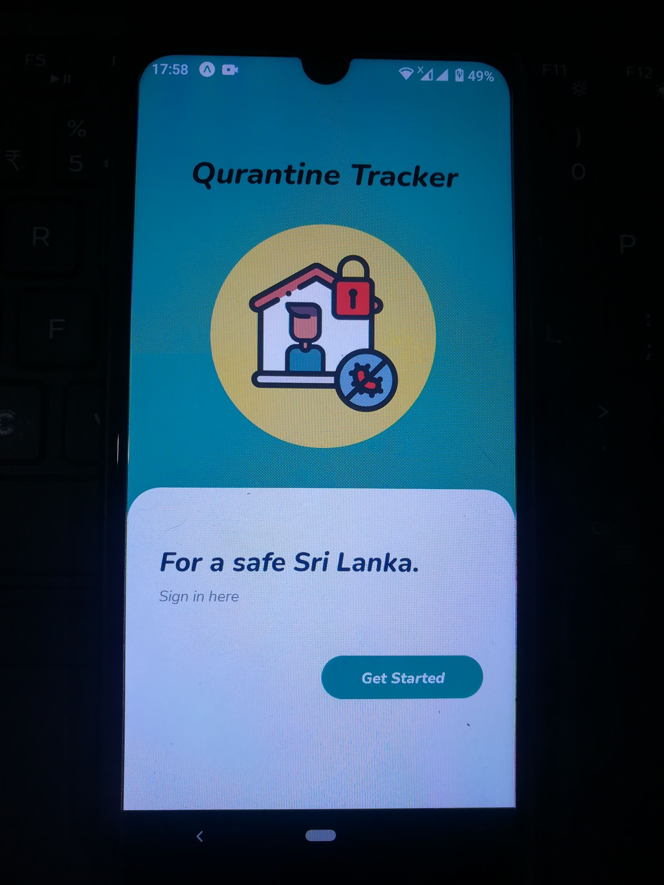
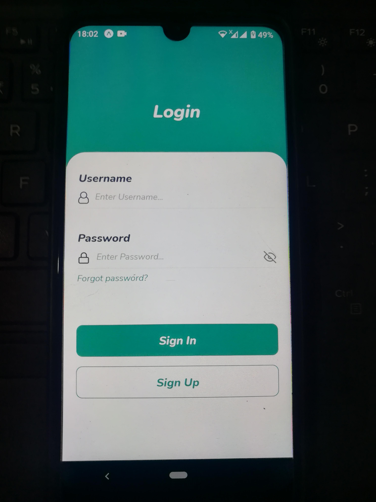
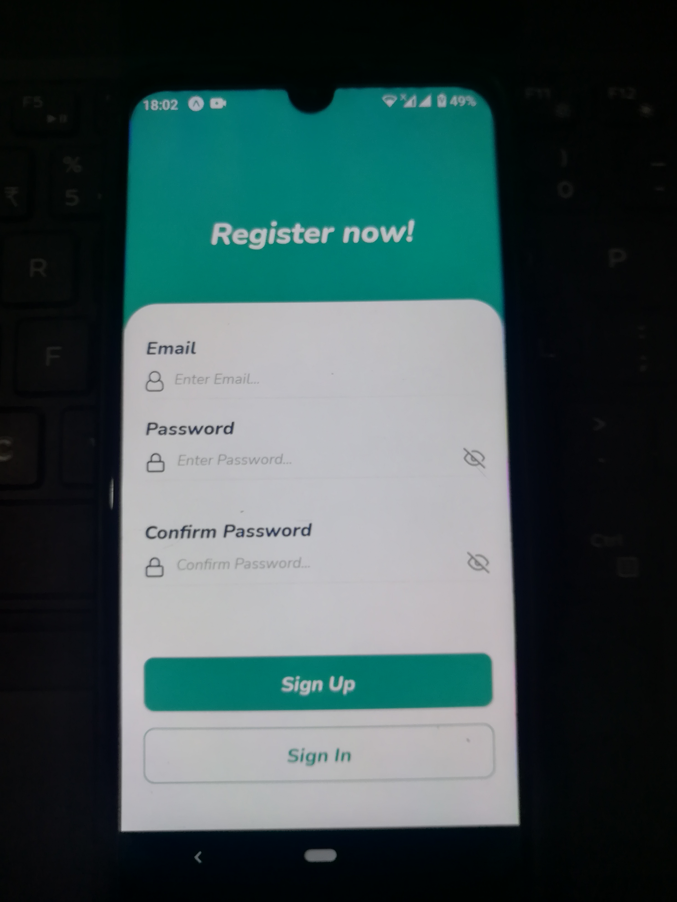

# Mobile Application
  * Technology: React Native 

## For nice appearence: 
  * React native vector icons
  * Animated API
  * Custom fonts from ‘Google Fonts’
  
## Login and signup

## How it looks 0n a physical device
  * Android (version 10)
  
  
  
  
## Authentication and form validation
 
### Authentication and form validation

### If one of the username and password fields or both are invalid

* Username length >=  4 character
* Password length >=  8 character
* Otherwise an error message will pop up as a alert
* Reset password option

## For navigation: React navigation library
* Stack navigation: For login and signup screens
* Drawer navigation : All the other screens

For better user experience two kinds of navigations have been used to navigate though the different tabs of the mobile app.

## Drawer navigation

## Bottom tab navigator

 
