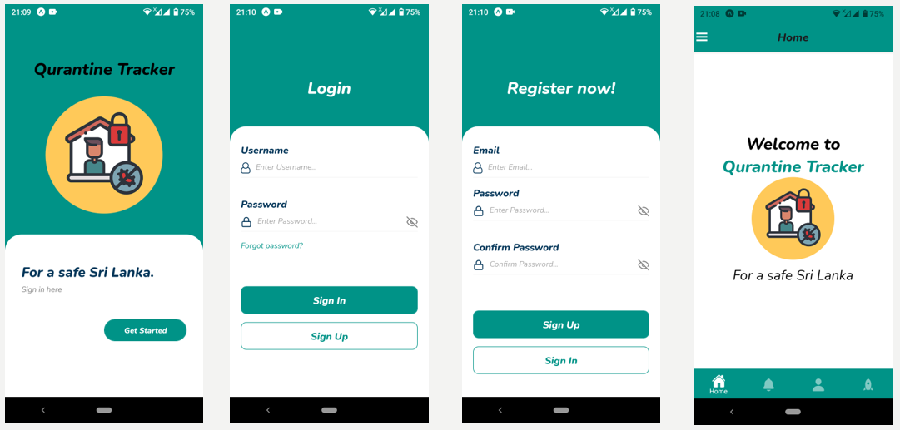
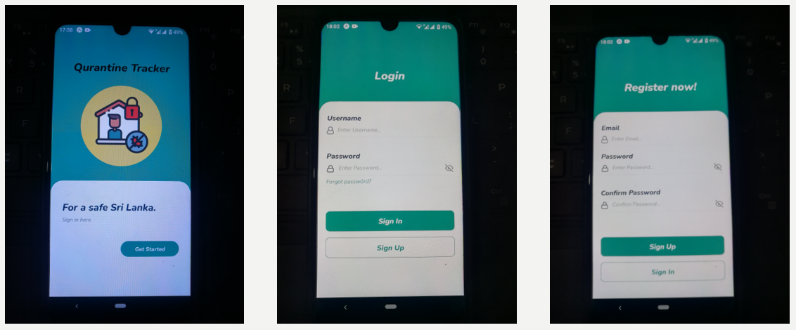
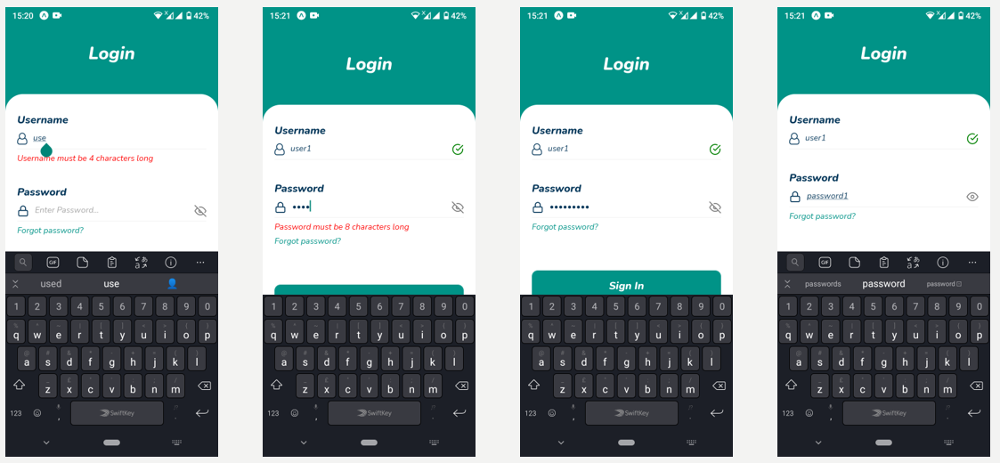
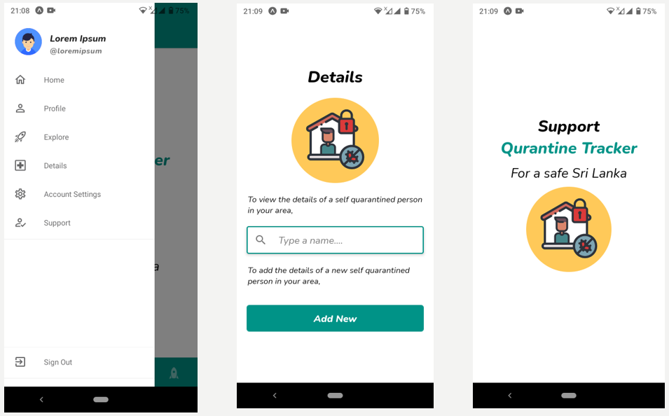
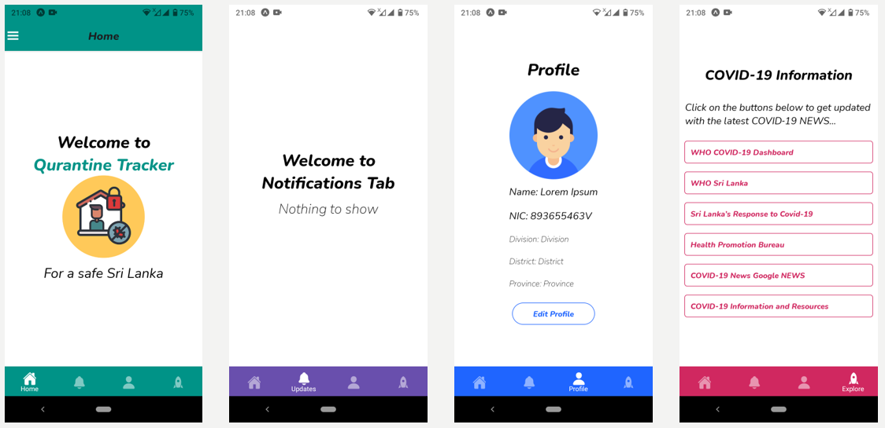

# Mobile Application
  * Technology: React Native 

## For nice appearence: 
  * React native vector icons
  * Animated API
  * Custom fonts from ‘Google Fonts’
  
## Login and signup

## How it looks 0n a physical device

  * Android (version 10)
   
   
## Authentication and form validation

* Username, password fields cannot be empty. Otherwise an error message will pop up as a alert.
* An error will pop up as a alert for invalid login credentials. 

* Username length >=  4 character 
* Password length >=  8 character

* Reset password option

## For navigation: React navigation library

* Stack navigation: For login and signup screens
* Drawer navigation : All the other screens

For better user experience two kinds of navigations have been used to navigate though the different tabs of the mobile app.

## Drawer navigation

## Bottom tab navigator

 
